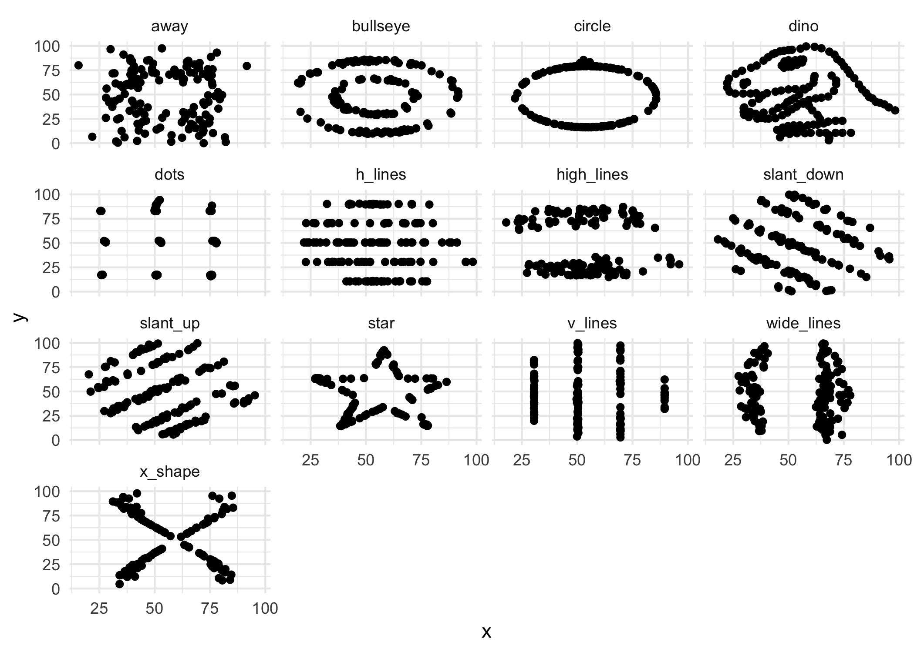
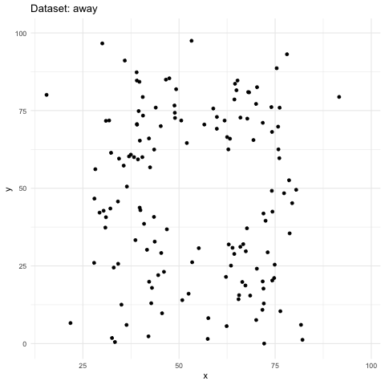
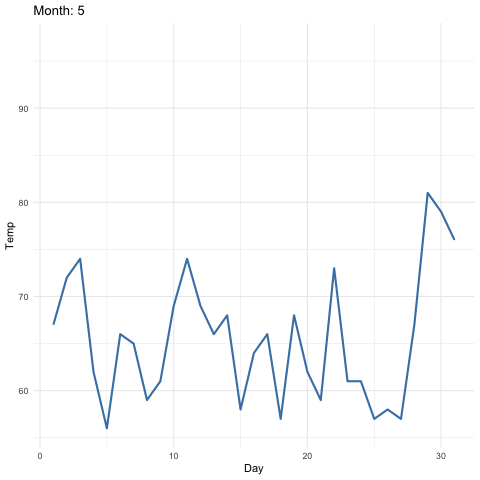
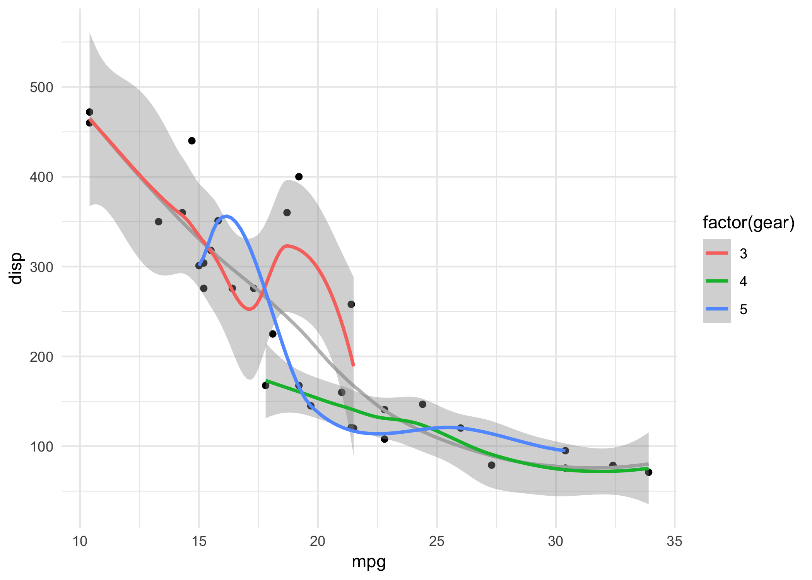
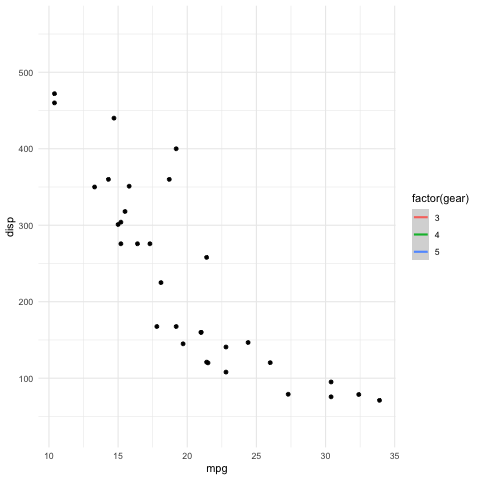

```{r setup, include=FALSE}
knitr::opts_chunk$set(echo = TRUE)
```
 
# Introduction

This set of gganimate examples comes from the excellent slides tweeted here: https://twitter.com/mitchoharawild/status/1108913366100119553?s=12 

The tweet links to these great slides: https://mitchelloharawild.com/wombat-gganimate/#1 

Code for the slides is here: https://github.com/numbats/gganimate-workshop

To help understand more intuitively how gganimate works, most of the examples from the slides are presented below as static ggplot charts along with a few rows of the raw data. Then as the animated version using gganimate.
 
I've also made it clear which package each function comes from, either ggplot2 or gganimate by adding ggnaimte:: or ggplot2:: before each function.

This describes the functions of gganimate and what they do well: https://gganimate.com/reference/index.html

```{r, echo=TRUE, warning=FALSE, message=FALSE}
library(ggplot2)
library(gganimate)
library(transformr) # devtools::install_github("thomasp85/transformr")
library(magick)
library(gifski)
library(png)
library(datasauRus)
library(gapminder)
library(kableExtra)

kable_table <- function(table, title) {
  kableExtra::kable(table, caption = title) %>%
    kable_styling(latex_options = "hold_position", full_width = F, bootstrap_options = c("striped", "condensed"), position = "left")
}
```

# transition_reveal()

Adapting this example: https://mitchelloharawild.com/wombat-gganimate/#37

```{r, echo=TRUE, warning=FALSE, message=FALSE}
kable_table(head(economics), "Top few rows of ggplot2::economics data in plots below")
```

Static ggplot plot
```{r, echo=TRUE, warning=FALSE, message=FALSE, out.width = "60%"}
p <- 
  ggplot2::ggplot(ggplot2::economics) +
  ggplot2::aes(date, unemploy) +
  ggplot2::geom_line() +
  ggplot2::theme_minimal()
ggplot2::ggsave(filename = "./images/economics.png", plot = p)
knitr::include_graphics("images/economics.png") 
```

Animated ggnanimate plot
```{r, echo=TRUE, warning=FALSE, message=FALSE, results="hide"}
p + gganimate::transition_reveal(date)
print(p)
gganimate::anim_save(filename = "./images/economics.gif")
```
```{r, echo=FALSE, warning=FALSE, message=FALSE, out.width = "60%"}
knitr::include_graphics("images/economics.gif") 
```

# transition_states()

This example: https://mitchelloharawild.com/wombat-gganimate/#42

```{r, echo=TRUE, warning=FALSE, message=FALSE, out.width = "60%"}
kable_table(head(datasauRus::datasaurus_dozen), "Top few rows of datasauRus::datasaurus_dozen data in  2 plots below")
```

Static ggplot chart
```{r, echo=TRUE, warning=FALSE, message=FALSE, out.width = "60%"}
p <- 
  ggplot2::ggplot(data = datasauRus::datasaurus_dozen) +
  ggplot2::aes(x, y) +
  ggplot2::geom_point() +
  ggplot2::facet_wrap(~dataset)  +
  ggplot2::theme_minimal()
ggplot2::ggsave(filename = "./images/datasauRus.png", plot = p)
 
```

Animated gganimate plot
```{r, echo=TRUE, warning=FALSE, message=FALSE, results="hide"}
p <- 
  ggplot2::ggplot(data = datasauRus::datasaurus_dozen) +
  ggplot2::aes(x, y) +
  ggplot2::geom_point() +
  # ggplot2::facet_wrap(~dataset)
  gganimate::transition_states(states = dataset, transition_length = 3, state_length = 1) +
  ggplot2::labs(title = "Dataset: {closest_state}") +
  ggplot2::theme_minimal()
print(p)
gganimate::anim_save(filename = "./images/datasauRus.gif")
```
```{r, echo=FALSE, warning=FALSE, message=FALSE, out.width = "60%"}
 
```


# transition_time() and shadow_wake()

This example: https://mitchelloharawild.com/wombat-gganimate/#74

```{r, echo=TRUE, warning=FALSE, message=FALSE, out.width = "60%"}
kable_table(head(gapminder::gapminder), "Top few rows of gapminder::gapminder data in 2 plots below")
```

Static ggplot plot
```{r, echo=TRUE, warning=FALSE, message=FALSE, out.width = "60%"}
p <- 
  ggplot2::ggplot(data = gapminder::gapminder) + 
  ggplot2::aes(x = gdpPercap, y=lifeExp, size = pop, colour = country) +
  ggplot2::geom_point(show.legend = FALSE) +
  ggplot2::scale_x_log10() +
  ggplot2::scale_color_viridis_d() +
  ggplot2::scale_size(range = c(2, 12)) +
  ggplot2::labs(x = "GDP per capita", y = "Life expectancy") +
  ggplot2::facet_wrap(~year) +
  ggplot2::theme_minimal()
ggplot2::ggsave(filename = "./images/gapminder.png", plot = p)
knitr::include_graphics("images/gapminder.png") 
```

Animated gganimate plot
```{r, echo=TRUE, warning=FALSE, message=FALSE, results="hide"}
p <- 
  ggplot2::ggplot(data = gapminder::gapminder) + 
  ggplot2::aes(x = gdpPercap, y=lifeExp, size = pop, colour = country) +
  ggplot2::geom_point(show.legend = FALSE) +
  ggplot2::scale_x_log10() +
  ggplot2::scale_color_viridis_d() +
  ggplot2::scale_size(range = c(2, 12)) +
  ggplot2::labs(x = "GDP per capita", y = "Life expectancy") +
  # ggplot2::facet_wrap(~year)
  gganimate::transition_time(time = year) +
  ggplot2::labs(title = "Year: {frame_time}") +
  gganimate::shadow_wake(wake_length = 0.1, alpha = FALSE) +
  ggplot2::theme_minimal()
print(p)
gganimate::anim_save(filename = "./images/gapminder.gif")
```

```{r, echo=FALSE, warning=FALSE, message=FALSE, out.width = "60%"}
knitr::include_graphics("images/gapminder.gif") 
```

# transition_states() and shadow_wake()

This example: https://mitchelloharawild.com/wombat-gganimate/#57

```{r, echo=TRUE, warning=FALSE, message=FALSE, out.width = "60%"}
kable_table(head(datasets::iris), "Top few rows of datasets::iris data in 2 plots below")
```

Static ggplot plot
```{r, echo=TRUE, warning=FALSE, message=FALSE, out.width = "60%"}
p <- 
  ggplot2::ggplot(data = datasets::iris) +
  ggplot2::aes(x = Petal.Length, y = Sepal.Length) +
  ggplot2::geom_point(size = 2) +
  ggplot2::facet_wrap(~Species) +
  ggplot2::theme_minimal()
ggplot2::ggsave(filename = "./images/iris.png", plot = p)
knitr::include_graphics("images/iris.png") 
```

Animated gganimate plot
```{r, echo=TRUE, warning=FALSE, message=FALSE, results="hide"}
p <- 
  ggplot2::ggplot(data = datasets::iris) +
  ggplot2::aes(x = Petal.Length, y = Sepal.Length) +
  ggplot2::geom_point(size = 2) +
  # ggplot2::facet_wrap(~Species)
  gganimate::transition_states(states = Species, transition_length = 4, state_length = 1) +
  ggplot2::labs(title = "{closest_state}") +
  gganimate::shadow_wake(wake_length = 0.1) +
  ggplot2::theme_minimal()
print(p)
gganimate::anim_save(filename = "./images/iris.gif")
```

```{r, echo=FALSE, warning=FALSE, message=FALSE, out.width = "60%"}
knitr::include_graphics("images/iris.gif") 
```

# transition_time() and shadow_mark()

This example: https://mitchelloharawild.com/wombat-gganimate/#58

```{r, echo=TRUE, warning=FALSE, message=FALSE, out.width = "60%"}
kable_table(head(datasets::airquality), "Top few rows of datasets::airquality data in 2 plots below")
```

Static ggplot plot
```{r, echo=TRUE, warning=FALSE, message=FALSE, out.width = "60%"}
p <- 
  ggplot2::ggplot(data = datasets::airquality) +
  ggplot2::aes(x = Day, y = Temp) +
  ggplot2::geom_line(color = 'steelblue', size = 1) +
  ggplot2::facet_wrap(~Month) +
  ggplot2::theme_minimal()
ggplot2::ggsave(filename = "./images/airquality.png", plot = p)
knitr::include_graphics("images/airquality.png") 
```

Animated gganimate plot
```{r, echo=TRUE, warning=FALSE, message=FALSE, results="hide"}
p <- 
  ggplot2::ggplot(data = datasets::airquality) +
  ggplot2::aes(x = Day, y = Temp) +
  ggplot2::geom_line(color = 'steelblue', size = 1) +
  # ggplot2::facet_wrap(~Month)
  gganimate::transition_time(time = Month) +
  ggplot2::labs(title = "Month: {frame_time}") +
  gganimate::shadow_mark(colour = 'grey', size = 0.75) +
  ggplot2::theme_minimal()
print(p)
gganimate::anim_save(filename = "./images/airquality.gif")
```

```{r, echo=FALSE, warning=FALSE, message=FALSE, out.width = "60%"}
 
```

# transition_layers()

This example: https://mitchelloharawild.com/wombat-gganimate/#58

```{r, echo=TRUE, warning=FALSE, message=FALSE, out.width = "60%"}
kable_table(head(datasets::mtcars), "Top few rows of datasets::mtcars data in 2 plots below")
```

Static ggplot plot
```{r, echo=TRUE, warning=FALSE, message=FALSE, out.width = "60%"}
p <- 
  ggplot2::ggplot(data = datasets::mtcars) +
  ggplot2::aes(mpg, disp) + 
  ggplot2::geom_point() +
  ggplot2::geom_smooth(colour = 'grey', se = FALSE) +
  ggplot2::geom_smooth(aes(colour = factor(gear))) +
  ggplot2::theme_minimal()
ggplot2::ggsave(filename = "./images/mtcars.png", plot = p)
 
```

Animated gganimate plot
```{r, echo=TRUE, warning=FALSE, message=FALSE, results="hide"}
p <- 
  ggplot2::ggplot(data = datasets::mtcars) +
  ggplot2::aes(mpg, disp) + 
  ggplot2::geom_point() +
  ggplot2::geom_smooth(colour = 'grey', se = FALSE) +
  ggplot2::geom_smooth(aes(colour = factor(gear))) +
  gganimate::transition_layers(layer_length = 1, transition_length = 2,
                    from_blank = FALSE, keep_layers = c(Inf, 0, 0)) +
  gganimate::enter_fade() + 
  gganimate::exit_fade() +
  ggplot2::theme_minimal()
print(p)
gganimate::anim_save(filename = "./images/mtcars.gif")
```

```{r, echo=FALSE, warning=FALSE, message=FALSE, out.width = "60%"}
 
```


