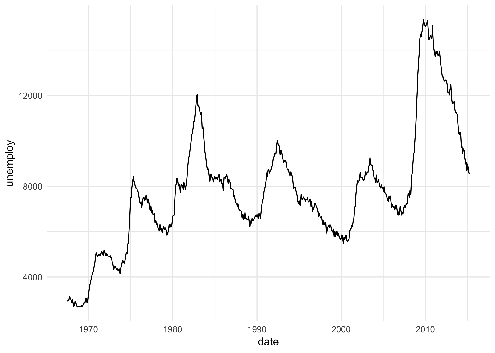
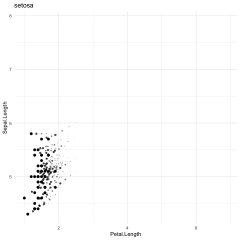

Understanding gganimate intuitively
================

-   [Introduction](#introduction)
-   [transition\_reveal()](#transition_reveal)
-   [transition\_states()](#transition_states)
-   [transition\_time() and shadow\_wake()](#transition_time-and-shadow_wake)
-   [transition\_states() and shadow\_wake()](#transition_states-and-shadow_wake)
-   [transition\_time() and shadow\_mark()](#transition_time-and-shadow_mark)
-   [transition\_layers()](#transition_layers)

Introduction
============

This set of gganimate examples comes from the excellent slides tweeted here: <https://twitter.com/mitchoharawild/status/1108913366100119553?s=12>

The tweet links to these great slides: <https://mitchelloharawild.com/wombat-gganimate/#1>

Code for the slides is here: <https://github.com/numbats/gganimate-workshop>

To help understand more intuitively how gganimate works, most of the examples from the slides are presented below as static ggplot charts along with a few rows of the raw data. Then as the animated version using gganimate.

I've also made it clear which package each function comes from, either ggplot2 or gganimate by adding ggnaimte:: or ggplot2:: before each function.

This describes the functions of gganimate and what they do well: <https://gganimate.com/reference/index.html>

``` r
library(ggplot2)
library(gganimate)
library(transformr) # devtools::install_github("thomasp85/transformr")
library(magick)
library(gifski)
library(png)
library(datasauRus)
library(gapminder)
library(kableExtra)

kable_table <- function(table, title) {
  kableExtra::kable(table, caption = title) %>%
    kable_styling(latex_options = "hold_position", full_width = F, bootstrap_options = c("striped", "condensed"), position = "left")
}
```

transition\_reveal()
====================

Adapting this example: <https://mitchelloharawild.com/wombat-gganimate/#37>

``` r
kable_table(head(economics), "Top few rows of ggplot2::economics data in plots below")
```

<table class="table table-striped table-condensed" style="width: auto !important; ">
<caption>
Top few rows of ggplot2::economics data in plots below
</caption>
<thead>
<tr>
<th style="text-align:left;">
date
</th>
<th style="text-align:right;">
pce
</th>
<th style="text-align:right;">
pop
</th>
<th style="text-align:right;">
psavert
</th>
<th style="text-align:right;">
uempmed
</th>
<th style="text-align:right;">
unemploy
</th>
</tr>
</thead>
<tbody>
<tr>
<td style="text-align:left;">
1967-07-01
</td>
<td style="text-align:right;">
507.4
</td>
<td style="text-align:right;">
198712
</td>
<td style="text-align:right;">
12.5
</td>
<td style="text-align:right;">
4.5
</td>
<td style="text-align:right;">
2944
</td>
</tr>
<tr>
<td style="text-align:left;">
1967-08-01
</td>
<td style="text-align:right;">
510.5
</td>
<td style="text-align:right;">
198911
</td>
<td style="text-align:right;">
12.5
</td>
<td style="text-align:right;">
4.7
</td>
<td style="text-align:right;">
2945
</td>
</tr>
<tr>
<td style="text-align:left;">
1967-09-01
</td>
<td style="text-align:right;">
516.3
</td>
<td style="text-align:right;">
199113
</td>
<td style="text-align:right;">
11.7
</td>
<td style="text-align:right;">
4.6
</td>
<td style="text-align:right;">
2958
</td>
</tr>
<tr>
<td style="text-align:left;">
1967-10-01
</td>
<td style="text-align:right;">
512.9
</td>
<td style="text-align:right;">
199311
</td>
<td style="text-align:right;">
12.5
</td>
<td style="text-align:right;">
4.9
</td>
<td style="text-align:right;">
3143
</td>
</tr>
<tr>
<td style="text-align:left;">
1967-11-01
</td>
<td style="text-align:right;">
518.1
</td>
<td style="text-align:right;">
199498
</td>
<td style="text-align:right;">
12.5
</td>
<td style="text-align:right;">
4.7
</td>
<td style="text-align:right;">
3066
</td>
</tr>
<tr>
<td style="text-align:left;">
1967-12-01
</td>
<td style="text-align:right;">
525.8
</td>
<td style="text-align:right;">
199657
</td>
<td style="text-align:right;">
12.1
</td>
<td style="text-align:right;">
4.8
</td>
<td style="text-align:right;">
3018
</td>
</tr>
</tbody>
</table>
Static ggplot plot

``` r
p <- 
  ggplot2::ggplot(ggplot2::economics) +
  ggplot2::aes(date, unemploy) +
  ggplot2::geom_line() +
  ggplot2::theme_minimal()
ggplot2::ggsave(filename = "./images/economics.png", plot = p)
 
```


Animated ggnanimate plot

``` r
p + gganimate::transition_reveal(date)
print(p)
```


``` r
gganimate::anim_save(filename = "./images/economics.gif")
```


transition\_states()
====================

This example: <https://mitchelloharawild.com/wombat-gganimate/#42>

``` r
kable_table(head(datasauRus::datasaurus_dozen), "Top few rows of datasauRus::datasaurus_dozen data in  2 plots below")
```

<table class="table table-striped table-condensed" style="width: auto !important; ">
<caption>
Top few rows of datasauRus::datasaurus\_dozen data in 2 plots below
</caption>
<thead>
<tr>
<th style="text-align:left;">
dataset
</th>
<th style="text-align:right;">
x
</th>
<th style="text-align:right;">
y
</th>
</tr>
</thead>
<tbody>
<tr>
<td style="text-align:left;">
dino
</td>
<td style="text-align:right;">
55.3846
</td>
<td style="text-align:right;">
97.1795
</td>
</tr>
<tr>
<td style="text-align:left;">
dino
</td>
<td style="text-align:right;">
51.5385
</td>
<td style="text-align:right;">
96.0256
</td>
</tr>
<tr>
<td style="text-align:left;">
dino
</td>
<td style="text-align:right;">
46.1538
</td>
<td style="text-align:right;">
94.4872
</td>
</tr>
<tr>
<td style="text-align:left;">
dino
</td>
<td style="text-align:right;">
42.8205
</td>
<td style="text-align:right;">
91.4103
</td>
</tr>
<tr>
<td style="text-align:left;">
dino
</td>
<td style="text-align:right;">
40.7692
</td>
<td style="text-align:right;">
88.3333
</td>
</tr>
<tr>
<td style="text-align:left;">
dino
</td>
<td style="text-align:right;">
38.7179
</td>
<td style="text-align:right;">
84.8718
</td>
</tr>
</tbody>
</table>
Static ggplot chart

``` r
p <- 
  ggplot2::ggplot(data = datasauRus::datasaurus_dozen) +
  ggplot2::aes(x, y) +
  ggplot2::geom_point() +
  ggplot2::facet_wrap(~dataset)  +
  ggplot2::theme_minimal()
ggplot2::ggsave(filename = "./images/datasauRus.png", plot = p)
```

 Animated gganimate plot

``` r
p <- 
  ggplot2::ggplot(data = datasauRus::datasaurus_dozen) +
  ggplot2::aes(x, y) +
  ggplot2::geom_point() +
  # ggplot2::facet_wrap(~dataset)
  gganimate::transition_states(states = dataset, transition_length = 3, state_length = 1) +
  ggplot2::labs(title = "Dataset: {closest_state}") +
  ggplot2::theme_minimal()
print(p)
gganimate::anim_save(filename = "./images/datasauRus.gif")
```


transition\_time() and shadow\_wake()
=====================================

This example: <https://mitchelloharawild.com/wombat-gganimate/#74>

``` r
kable_table(head(gapminder::gapminder), "Top few rows of gapminder::gapminder data in 2 plots below")
```

<table class="table table-striped table-condensed" style="width: auto !important; ">
<caption>
Top few rows of gapminder::gapminder data in 2 plots below
</caption>
<thead>
<tr>
<th style="text-align:left;">
country
</th>
<th style="text-align:left;">
continent
</th>
<th style="text-align:right;">
year
</th>
<th style="text-align:right;">
lifeExp
</th>
<th style="text-align:right;">
pop
</th>
<th style="text-align:right;">
gdpPercap
</th>
</tr>
</thead>
<tbody>
<tr>
<td style="text-align:left;">
Afghanistan
</td>
<td style="text-align:left;">
Asia
</td>
<td style="text-align:right;">
1952
</td>
<td style="text-align:right;">
28.801
</td>
<td style="text-align:right;">
8425333
</td>
<td style="text-align:right;">
779.4453
</td>
</tr>
<tr>
<td style="text-align:left;">
Afghanistan
</td>
<td style="text-align:left;">
Asia
</td>
<td style="text-align:right;">
1957
</td>
<td style="text-align:right;">
30.332
</td>
<td style="text-align:right;">
9240934
</td>
<td style="text-align:right;">
820.8530
</td>
</tr>
<tr>
<td style="text-align:left;">
Afghanistan
</td>
<td style="text-align:left;">
Asia
</td>
<td style="text-align:right;">
1962
</td>
<td style="text-align:right;">
31.997
</td>
<td style="text-align:right;">
10267083
</td>
<td style="text-align:right;">
853.1007
</td>
</tr>
<tr>
<td style="text-align:left;">
Afghanistan
</td>
<td style="text-align:left;">
Asia
</td>
<td style="text-align:right;">
1967
</td>
<td style="text-align:right;">
34.020
</td>
<td style="text-align:right;">
11537966
</td>
<td style="text-align:right;">
836.1971
</td>
</tr>
<tr>
<td style="text-align:left;">
Afghanistan
</td>
<td style="text-align:left;">
Asia
</td>
<td style="text-align:right;">
1972
</td>
<td style="text-align:right;">
36.088
</td>
<td style="text-align:right;">
13079460
</td>
<td style="text-align:right;">
739.9811
</td>
</tr>
<tr>
<td style="text-align:left;">
Afghanistan
</td>
<td style="text-align:left;">
Asia
</td>
<td style="text-align:right;">
1977
</td>
<td style="text-align:right;">
38.438
</td>
<td style="text-align:right;">
14880372
</td>
<td style="text-align:right;">
786.1134
</td>
</tr>
</tbody>
</table>
Static ggplot plot

``` r
p <- 
  ggplot2::ggplot(data = gapminder::gapminder) + 
  ggplot2::aes(x = gdpPercap, y=lifeExp, size = pop, colour = country) +
  ggplot2::geom_point(show.legend = FALSE) +
  ggplot2::scale_x_log10() +
  ggplot2::scale_color_viridis_d() +
  ggplot2::scale_size(range = c(2, 12)) +
  ggplot2::labs(x = "GDP per capita", y = "Life expectancy") +
  ggplot2::facet_wrap(~year) +
  ggplot2::theme_minimal()
ggplot2::ggsave(filename = "./images/gapminder.png", plot = p)
```

 Animated gganimate plot

``` r
p <- 
  ggplot2::ggplot(data = gapminder::gapminder) + 
  ggplot2::aes(x = gdpPercap, y=lifeExp, size = pop, colour = country) +
  ggplot2::geom_point(show.legend = FALSE) +
  ggplot2::scale_x_log10() +
  ggplot2::scale_color_viridis_d() +
  ggplot2::scale_size(range = c(2, 12)) +
  ggplot2::labs(x = "GDP per capita", y = "Life expectancy") +
  # ggplot2::facet_wrap(~year)
  gganimate::transition_time(time = year) +
  ggplot2::labs(title = "Year: {frame_time}") +
  gganimate::shadow_wake(wake_length = 0.1, alpha = FALSE) +
  ggplot2::theme_minimal()
print(p)
gganimate::anim_save(filename = "./images/gapminder.gif")
```


transition\_states() and shadow\_wake()
=======================================

This example: <https://mitchelloharawild.com/wombat-gganimate/#57>

``` r
kable_table(head(datasets::iris), "Top few rows of datasets::iris data in 2 plots below")
```

<table class="table table-striped table-condensed" style="width: auto !important; ">
<caption>
Top few rows of datasets::iris data in 2 plots below
</caption>
<thead>
<tr>
<th style="text-align:right;">
Sepal.Length
</th>
<th style="text-align:right;">
Sepal.Width
</th>
<th style="text-align:right;">
Petal.Length
</th>
<th style="text-align:right;">
Petal.Width
</th>
<th style="text-align:left;">
Species
</th>
</tr>
</thead>
<tbody>
<tr>
<td style="text-align:right;">
5.1
</td>
<td style="text-align:right;">
3.5
</td>
<td style="text-align:right;">
1.4
</td>
<td style="text-align:right;">
0.2
</td>
<td style="text-align:left;">
setosa
</td>
</tr>
<tr>
<td style="text-align:right;">
4.9
</td>
<td style="text-align:right;">
3.0
</td>
<td style="text-align:right;">
1.4
</td>
<td style="text-align:right;">
0.2
</td>
<td style="text-align:left;">
setosa
</td>
</tr>
<tr>
<td style="text-align:right;">
4.7
</td>
<td style="text-align:right;">
3.2
</td>
<td style="text-align:right;">
1.3
</td>
<td style="text-align:right;">
0.2
</td>
<td style="text-align:left;">
setosa
</td>
</tr>
<tr>
<td style="text-align:right;">
4.6
</td>
<td style="text-align:right;">
3.1
</td>
<td style="text-align:right;">
1.5
</td>
<td style="text-align:right;">
0.2
</td>
<td style="text-align:left;">
setosa
</td>
</tr>
<tr>
<td style="text-align:right;">
5.0
</td>
<td style="text-align:right;">
3.6
</td>
<td style="text-align:right;">
1.4
</td>
<td style="text-align:right;">
0.2
</td>
<td style="text-align:left;">
setosa
</td>
</tr>
<tr>
<td style="text-align:right;">
5.4
</td>
<td style="text-align:right;">
3.9
</td>
<td style="text-align:right;">
1.7
</td>
<td style="text-align:right;">
0.4
</td>
<td style="text-align:left;">
setosa
</td>
</tr>
</tbody>
</table>
Static ggplot plot

``` r
p <- 
  ggplot2::ggplot(data = datasets::iris) +
  ggplot2::aes(x = Petal.Length, y = Sepal.Length) +
  ggplot2::geom_point(size = 2) +
  ggplot2::facet_wrap(~Species) +
  ggplot2::theme_minimal()
ggplot2::ggsave(filename = "./images/iris.png", plot = p)
```


Animated gganimate plot

``` r
p <- 
  ggplot2::ggplot(data = datasets::iris) +
  ggplot2::aes(x = Petal.Length, y = Sepal.Length) +
  ggplot2::geom_point(size = 2) +
  # ggplot2::facet_wrap(~Species)
  gganimate::transition_states(states = Species, transition_length = 4, state_length = 1) +
  ggplot2::labs(title = "{closest_state}") +
  gganimate::shadow_wake(wake_length = 0.1) +
  ggplot2::theme_minimal()
print(p)
gganimate::anim_save(filename = "./images/iris.gif")
```



transition\_time() and shadow\_mark()
=====================================

This example: <https://mitchelloharawild.com/wombat-gganimate/#58>

``` r
kable_table(head(datasets::airquality), "Top few rows of datasets::airquality data in 2 plots below")
```

<table class="table table-striped table-condensed" style="width: auto !important; ">
<caption>
Top few rows of datasets::airquality data in 2 plots below
</caption>
<thead>
<tr>
<th style="text-align:right;">
Ozone
</th>
<th style="text-align:right;">
Solar.R
</th>
<th style="text-align:right;">
Wind
</th>
<th style="text-align:right;">
Temp
</th>
<th style="text-align:right;">
Month
</th>
<th style="text-align:right;">
Day
</th>
</tr>
</thead>
<tbody>
<tr>
<td style="text-align:right;">
41
</td>
<td style="text-align:right;">
190
</td>
<td style="text-align:right;">
7.4
</td>
<td style="text-align:right;">
67
</td>
<td style="text-align:right;">
5
</td>
<td style="text-align:right;">
1
</td>
</tr>
<tr>
<td style="text-align:right;">
36
</td>
<td style="text-align:right;">
118
</td>
<td style="text-align:right;">
8.0
</td>
<td style="text-align:right;">
72
</td>
<td style="text-align:right;">
5
</td>
<td style="text-align:right;">
2
</td>
</tr>
<tr>
<td style="text-align:right;">
12
</td>
<td style="text-align:right;">
149
</td>
<td style="text-align:right;">
12.6
</td>
<td style="text-align:right;">
74
</td>
<td style="text-align:right;">
5
</td>
<td style="text-align:right;">
3
</td>
</tr>
<tr>
<td style="text-align:right;">
18
</td>
<td style="text-align:right;">
313
</td>
<td style="text-align:right;">
11.5
</td>
<td style="text-align:right;">
62
</td>
<td style="text-align:right;">
5
</td>
<td style="text-align:right;">
4
</td>
</tr>
<tr>
<td style="text-align:right;">
NA
</td>
<td style="text-align:right;">
NA
</td>
<td style="text-align:right;">
14.3
</td>
<td style="text-align:right;">
56
</td>
<td style="text-align:right;">
5
</td>
<td style="text-align:right;">
5
</td>
</tr>
<tr>
<td style="text-align:right;">
28
</td>
<td style="text-align:right;">
NA
</td>
<td style="text-align:right;">
14.9
</td>
<td style="text-align:right;">
66
</td>
<td style="text-align:right;">
5
</td>
<td style="text-align:right;">
6
</td>
</tr>
</tbody>
</table>
Static ggplot plot

``` r
p <- 
  ggplot2::ggplot(data = datasets::airquality) +
  ggplot2::aes(x = Day, y = Temp) +
  ggplot2::geom_line(color = 'steelblue', size = 1) +
  ggplot2::facet_wrap(~Month) +
  ggplot2::theme_minimal()
ggplot2::ggsave(filename = "./images/airquality.png", plot = p)
```


Animated gganimate plot

``` r
p <- 
  ggplot2::ggplot(data = datasets::airquality) +
  ggplot2::aes(x = Day, y = Temp) +
  ggplot2::geom_line(color = 'steelblue', size = 1) +
  # ggplot2::facet_wrap(~Month)
  gganimate::transition_time(time = Month) +
  ggplot2::labs(title = "Month: {frame_time}") +
  gganimate::shadow_mark(colour = 'grey', size = 0.75) +
  ggplot2::theme_minimal()
print(p)
gganimate::anim_save(filename = "./images/airquality.gif")
```


transition\_layers()
====================

This example: <https://mitchelloharawild.com/wombat-gganimate/#58>

``` r
kable_table(head(datasets::mtcars), "Top few rows of datasets::mtcars data in plot above")
```

<table class="table table-striped table-condensed" style="width: auto !important; ">
<caption>
Top few rows of datasets::mtcars data in plot above
</caption>
<thead>
<tr>
<th style="text-align:left;">
</th>
<th style="text-align:right;">
mpg
</th>
<th style="text-align:right;">
cyl
</th>
<th style="text-align:right;">
disp
</th>
<th style="text-align:right;">
hp
</th>
<th style="text-align:right;">
drat
</th>
<th style="text-align:right;">
wt
</th>
<th style="text-align:right;">
qsec
</th>
<th style="text-align:right;">
vs
</th>
<th style="text-align:right;">
am
</th>
<th style="text-align:right;">
gear
</th>
<th style="text-align:right;">
carb
</th>
</tr>
</thead>
<tbody>
<tr>
<td style="text-align:left;">
Mazda RX4
</td>
<td style="text-align:right;">
21.0
</td>
<td style="text-align:right;">
6
</td>
<td style="text-align:right;">
160
</td>
<td style="text-align:right;">
110
</td>
<td style="text-align:right;">
3.90
</td>
<td style="text-align:right;">
2.620
</td>
<td style="text-align:right;">
16.46
</td>
<td style="text-align:right;">
0
</td>
<td style="text-align:right;">
1
</td>
<td style="text-align:right;">
4
</td>
<td style="text-align:right;">
4
</td>
</tr>
<tr>
<td style="text-align:left;">
Mazda RX4 Wag
</td>
<td style="text-align:right;">
21.0
</td>
<td style="text-align:right;">
6
</td>
<td style="text-align:right;">
160
</td>
<td style="text-align:right;">
110
</td>
<td style="text-align:right;">
3.90
</td>
<td style="text-align:right;">
2.875
</td>
<td style="text-align:right;">
17.02
</td>
<td style="text-align:right;">
0
</td>
<td style="text-align:right;">
1
</td>
<td style="text-align:right;">
4
</td>
<td style="text-align:right;">
4
</td>
</tr>
<tr>
<td style="text-align:left;">
Datsun 710
</td>
<td style="text-align:right;">
22.8
</td>
<td style="text-align:right;">
4
</td>
<td style="text-align:right;">
108
</td>
<td style="text-align:right;">
93
</td>
<td style="text-align:right;">
3.85
</td>
<td style="text-align:right;">
2.320
</td>
<td style="text-align:right;">
18.61
</td>
<td style="text-align:right;">
1
</td>
<td style="text-align:right;">
1
</td>
<td style="text-align:right;">
4
</td>
<td style="text-align:right;">
1
</td>
</tr>
<tr>
<td style="text-align:left;">
Hornet 4 Drive
</td>
<td style="text-align:right;">
21.4
</td>
<td style="text-align:right;">
6
</td>
<td style="text-align:right;">
258
</td>
<td style="text-align:right;">
110
</td>
<td style="text-align:right;">
3.08
</td>
<td style="text-align:right;">
3.215
</td>
<td style="text-align:right;">
19.44
</td>
<td style="text-align:right;">
1
</td>
<td style="text-align:right;">
0
</td>
<td style="text-align:right;">
3
</td>
<td style="text-align:right;">
1
</td>
</tr>
<tr>
<td style="text-align:left;">
Hornet Sportabout
</td>
<td style="text-align:right;">
18.7
</td>
<td style="text-align:right;">
8
</td>
<td style="text-align:right;">
360
</td>
<td style="text-align:right;">
175
</td>
<td style="text-align:right;">
3.15
</td>
<td style="text-align:right;">
3.440
</td>
<td style="text-align:right;">
17.02
</td>
<td style="text-align:right;">
0
</td>
<td style="text-align:right;">
0
</td>
<td style="text-align:right;">
3
</td>
<td style="text-align:right;">
2
</td>
</tr>
<tr>
<td style="text-align:left;">
Valiant
</td>
<td style="text-align:right;">
18.1
</td>
<td style="text-align:right;">
6
</td>
<td style="text-align:right;">
225
</td>
<td style="text-align:right;">
105
</td>
<td style="text-align:right;">
2.76
</td>
<td style="text-align:right;">
3.460
</td>
<td style="text-align:right;">
20.22
</td>
<td style="text-align:right;">
1
</td>
<td style="text-align:right;">
0
</td>
<td style="text-align:right;">
3
</td>
<td style="text-align:right;">
1
</td>
</tr>
</tbody>
</table>
Static ggplot plot

``` r
p <- 
  ggplot2::ggplot(data = datasets::mtcars) +
  ggplot2::aes(mpg, disp) + 
  ggplot2::geom_point() +
  ggplot2::geom_smooth(colour = 'grey', se = FALSE) +
  ggplot2::geom_smooth(aes(colour = factor(gear))) +
  ggplot2::theme_minimal()
ggplot2::ggsave(filename = "./images/mtcars.png", plot = p)
```


Animated gganimate plot

``` r
p <- 
  ggplot2::ggplot(data = datasets::mtcars) +
  ggplot2::aes(mpg, disp) + 
  ggplot2::geom_point() +
  ggplot2::geom_smooth(colour = 'grey', se = FALSE) +
  ggplot2::geom_smooth(aes(colour = factor(gear))) +
  gganimate::transition_layers(layer_length = 1, transition_length = 2,
                    from_blank = FALSE, keep_layers = c(Inf, 0, 0)) +
  gganimate::enter_fade() + 
  gganimate::exit_fade() +
  ggplot2::theme_minimal()
print(p)
gganimate::anim_save(filename = "./images/mtcars.gif")
```


